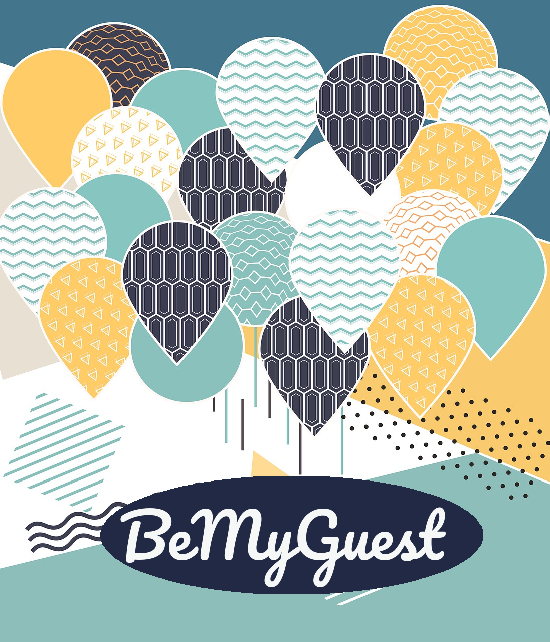
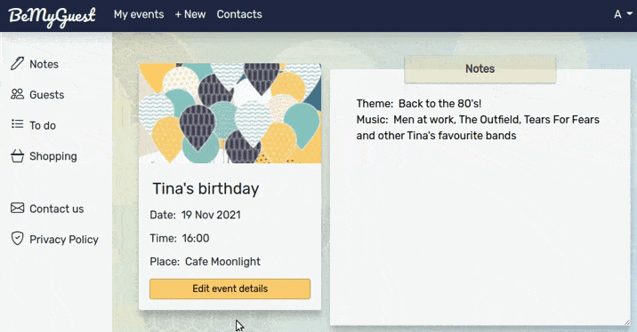
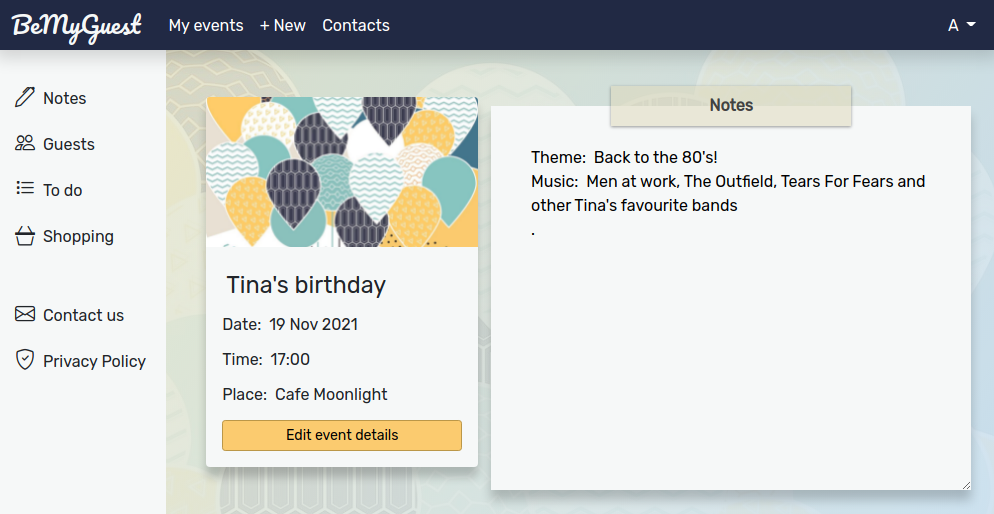
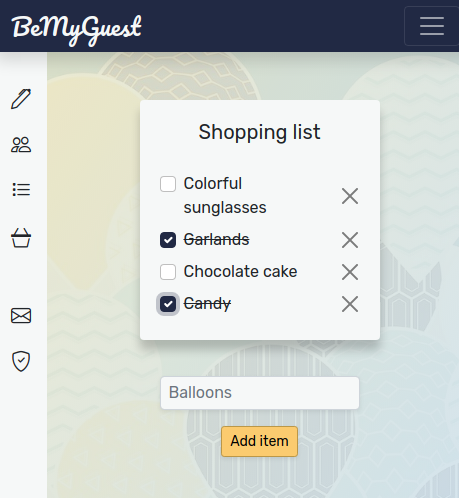
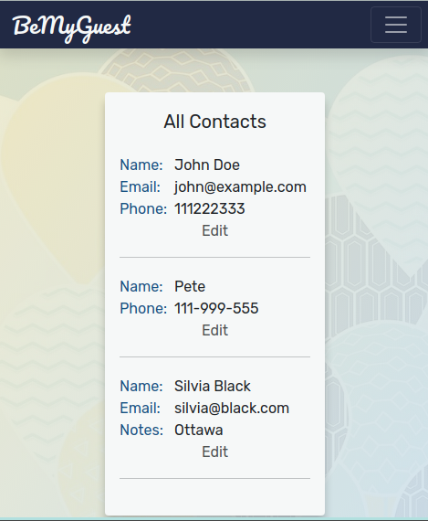
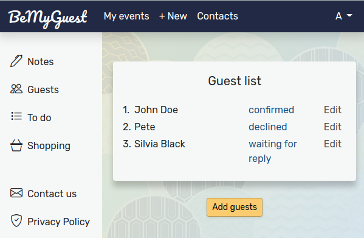

<h1 align="center">
  <br>
  <a href="https://bemyguestapp.herokuapp.com/"></a>
  <br>
  BeMyGuest
</h1>
<h3 align="center">A stress-free event planner for perfect events</h3>
<p align="center">
  
  
  
  
  
</p>
<p align="center">
</p>
<h3 align="center"><a  href="https://bemyguestapp.herokuapp.com//"></a></h3>

## Description
This is an event planner app that was built as a final project for Harvard's CS50 Introduction to Computer Science course. It aims to help users organize events by managing shopping, to do and guest lists.
[Short video](https://www.youtube.com/watch?v=vYt44GFptgg)

## Key Features
* Sign up and Log in
* Secure passwords
* Remember me
* Changing password
* Creating events
* Writing and saving event notes
* Adding contacts to the contact book
* Adding guests to the guest list from the contact book (same contacts can be added to the guest lists of different events without typing their information all over again)
* Managing guests' RSVP status (not invited, waiting for reply, confirmed etc.)
* Managing shopping and to do lists

## Project Screenshots
<p align="center">
  </p>
 <p align="center">
  
  
  </p>
 <p align="center">
  </p>

## Built With
* [Ruby](https://www.ruby-lang.org/en/), [JavaScript](https://developer.mozilla.org/en-US/docs/Web/JavaScript) - Programming languages
* [Ruby on Rails](https://rubyonrails.org/) - Ruby Framework
* [Bootstrap](https://getbootstrap.com/docs/5.0/getting-started/introduction/) - CSS Framework

## Installation
Clone the repository:
```
git clone git@github.com:RReiso/BeMyGuest.git
cd BeMyGuest
```
Install dependencies:
```
bundle && yarn
```
Initialize the database:
```
rails db:create db:migrate db:seed
```
Start the server:
```
rails s
```
You can see the project running at [http://localhost:3000](http://localhost:3000)

## Future Improvements
* Improve password change
* User authentication
* Include event budget management

## Reflection
With this project I expanded my knowledge in writing model validations (using attributes like presence, inclusion, format, acceptance etc.), witnessed the importance of writing and running model, controller and integration tests that I wrote using Minitest, practiced writing helper methods and creating model associations, and learned how to use SASS to modify Bootstrap themes.

One of the main difficulties I faced was combining data from existing data tables (Events, Contacts) into a third table (Connections). Creating a Connection model and using foreign keys allowed contacts to be added as guests to multiple events without repeating information from Contacts and Events tables.
Working on design and coloring has also been a challenge and I tried to create as smooth user experience as I could.
